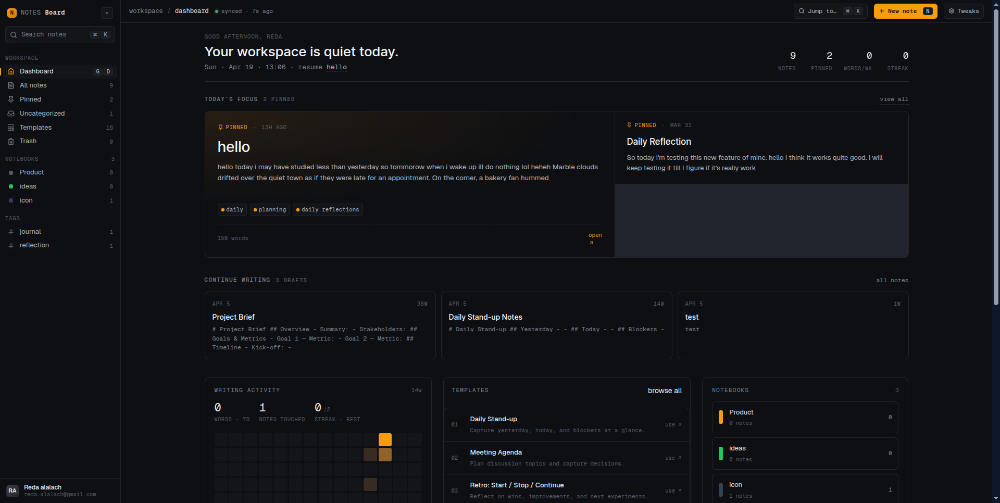
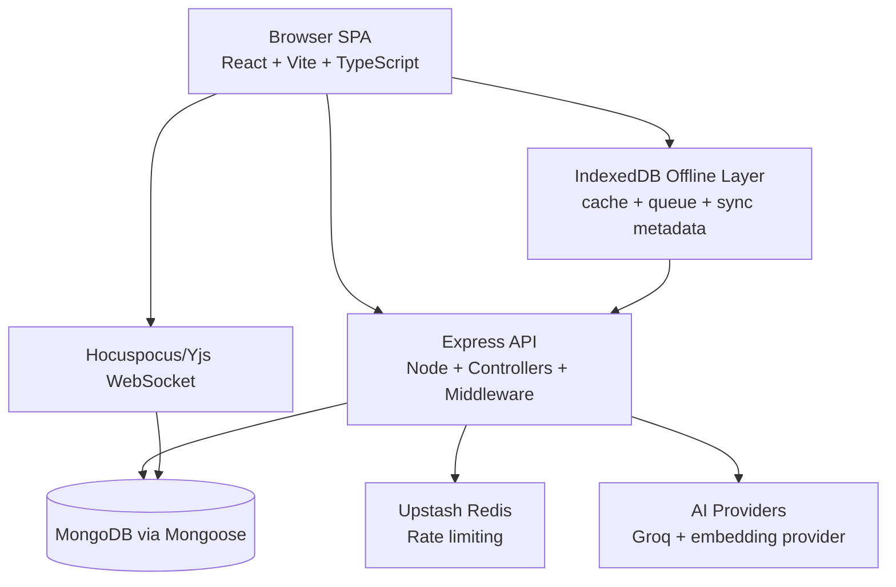

# NotesBoard

*Collaborative note workspaces with offline sync and AI-assisted capture.*

[](https://github.com/redaalch/notesBoard/actions/workflows/ci.yml) [](LICENSE)   [](https://notesboard.xyz)     

[Live Demo](https://notesboard.xyz) · [Report Bug](https://github.com/redaalch/notesBoard/issues/new?labels=bug&title=%5BBug%5D%20) · [Request Feature](https://github.com/redaalch/notesBoard/issues/new?labels=enhancement&title=%5BFeature%5D%20) · [Changelog](CHANGELOG.md)



## 🧭 About

NotesBoard is a full-stack collaborative notes platform designed for personal and team knowledge workflows. It combines a React + Vite + TypeScript frontend with a Node.js/Express API, MongoDB persistence, and shared contracts for analytics and notebook options.

The product focuses on three core goals:

- Real-time collaboration for shared note editing.
- Offline-first usage with reliable replay and conflict handling.
- Optional AI assistance for summarization, tagging, embeddings, and transcription.

Highlights:

- Workspace -> notebook -> note access hierarchy with role-aware enforcement.
- Notebook publishing and note publishing flows.
- Analytics endpoints for notebook insights and activity trends.
- Shared type contracts in `shared/` to reduce frontend/backend drift.

## ✨ Features

### Notes & Organization

- Notebook-based note organization with ordering and custom layouts.
- Tagging, pinning, and bulk note actions.
- Trash workflows for restore/purge/empty operations.
- Notebook templates plus import/export support.
- Saved notebook queries for repeatable filtered views.

### Collaboration

- Role-aware workspace and notebook member access.
- Note collaborator controls (viewer/commenter/editor).
- Share links and notebook invite paths.
- Real-time CRDT editing with Yjs + Hocuspocus.
- Presence/awareness updates and activity touch flows.

### Offline & PWA

- IndexedDB storage for notebook/note snapshots and mutation queueing.
- Offline mutation replay and notebook sync endpoints.
- Revision conflict detection with conflict metadata (`409` flow).
- Service worker caching for static assets and installable app behavior.

### AI & Insights

- AI note summaries and action-item extraction.
- Predictive tag suggestions and template generation.
- Embedding generation for semantic note features.
- Audio transcription endpoint.
- Notebook analytics and activity heatmap endpoints.

### Security

- JWT access token + HTTP-only refresh-session model.
- Helmet/CSP + CORS allowlist policy.
- Upstash-backed rate limiting.
- Validation and sanitization middleware across mutating routes.

## 🧱 Tech Stack

| Layer | Technology |
| --- | --- |
| Frontend | React 19, Vite 7, TypeScript 5, React Router 7, TanStack Query 5 |
| UI & Styling | Tailwind CSS, DaisyUI, Framer Motion, Lucide |
| Editor & Realtime Client | TipTap, Yjs, `@hocuspocus/provider`, `y-indexeddb` |
| Backend API | Node.js 20, Express 4, Mongoose 8, Express Validator |
| Collaboration Server | Hocuspocus Server, Yjs Transformer |
| Data Store | MongoDB via Mongoose |
| Rate Limiting | Upstash Redis + `@upstash/ratelimit` |
| Shared Contracts | `shared/analyticsTypes`, `shared/notebookOptions` |
| Testing & Quality | Vitest, ESLint, TypeScript typecheck |
| Performance Tooling | Lighthouse scripts, bundle reports, perf budgets |
| CI | GitHub Actions (`.github/workflows/ci.yml`) |

## 🗺️ Architecture

NotesBoard separates real-time synchronization from standard API traffic. The frontend handles CRUD, analytics, and publishing via REST, while collaboration sync uses a dedicated Hocuspocus/Yjs channel. Offline writes are buffered in IndexedDB and replayed through notebook sync endpoints.



```text
notesBoard/
├─ backend/
│  ├─ src/
│  ├─ tests/
│  └─ scripts/
├─ frontend/
│  ├─ src/
│  ├─ public/
│  ├─ scripts/perf/
│  └─ docs/
├─ shared/
│  ├─ analyticsTypes.ts
│  └─ notebookOptions.ts
└─ .github/
   └─ workflows/
```

| Path | Purpose |
| --- | --- |
| `backend/` | API routes, auth, data models, analytics services, collaboration server, and tests. |
| `frontend/` | SPA UI, editor integrations, offline sync, and performance scripts. |
| `shared/` | Shared contracts used by frontend and backend. |
| `.github/workflows/` | CI quality gates (lint/test/typecheck/audit). |

## ⚙️ Getting Started

### Prerequisites

- Node.js `20.x`
- npm `10.x`
- MongoDB instance
- Upstash Redis credentials (recommended for production parity)
- Optional AI provider credentials

### Installation

1. Clone the repository.

```bash
git clone https://github.com/redaalch/notesBoard.git
cd notesBoard
```

1. Install dependencies.

```bash
npm install
```

1. Copy environment templates.

```bash
cp backend/.env.example backend/.env
cp frontend/.env.example frontend/.env.local
```

### Environment Variables

#### Backend

| Name | Required | Default | Purpose |
| --- | --- | --- | --- |
| `NODE_ENV` | No | `development` | Runtime mode for app behavior and security toggles. |
| `PORT` | No | `5001` | API HTTP port. |
| `MONGO_URI` | Yes (prod) | None | MongoDB connection string. |
| `MONGO_DB` | No | `notesBoard` | Database name override. |
| `JWT_ACCESS_SECRET` | Yes (prod) | None | JWT access-token signing secret. |
| `JWT_ACCESS_TTL` | No | `15m` | Access-token TTL. |
| `JWT_REFRESH_TTL_MS` | No | `604800000` | Refresh-session TTL in milliseconds. |
| `FRONTEND_ORIGIN` | Yes (prod) | None | Allowed frontend origin for CORS. |
| `UPSTASH_REDIS_REST_URL` | Yes (prod) | None | Upstash REST URL for rate limits. |
| `UPSTASH_REDIS_REST_TOKEN` | Yes (prod) | None | Upstash REST token. |
| `COLLAB_WS_URL` | No | `ws://localhost:6001` (example) | Collaboration socket URL for policy/connect wiring. |
| `PUBLIC_HOST` | No | None | Public host hint for collaboration URL generation. |
| `PASSWORD_RESET_URL` | No | Derived fallback | Password reset link base override. |
| `GROQ_API_KEY` | No | None | Enables AI and transcription features. |
| `EMBEDDING_PROVIDER` | No | Auto (`none` without keys) | Embedding provider (`groq`, `gemini`, `none`). |
| `EMBEDDING_API_KEY` | No | None | Embedding API key override. |
| `MAILER_TO_GO_URL` | No | None | Transactional mail transport URL. |

#### Frontend

| Name | Required | Default | Purpose |
| --- | --- | --- | --- |
| `VITE_ENABLE_NOTEBOOK_ANALYTICS` | No | `false` | Enables notebook analytics UI. |
| `VITE_API_BASE_URL` | No | Dev: `http://localhost:5001/api`, Prod: `/api` | Axios API base URL. |
| `VITE_COLLAB_SERVER_URL` | No | Derived from API/origin | Explicit collaboration WebSocket URL. |
| `VITE_COLLAB_PATH` | No | `/collab` | Collaboration path when URL is derived. |
| `VITE_PUBLIC_NOTEBOOK_BASE_URL` | No | `${window.location.origin}/published` | Public notebook base URL in publish UI. |

<!-- markdownlint-disable MD033 -->

<details>
<summary>Advanced environment keys (optional)</summary>

Backend groups observed in source:

- Auth/cookies: `COOKIE_SECURE`, `COOKIE_DOMAIN`, `PASSWORD_RESET_TTL_MS`, `EMAIL_VERIFICATION_TTL_MS`
- Link generation: `CLIENT_APP_URL`, `FRONTEND_URL`, `NOTEBOOK_SHARE_URL`, `NOTEBOOK_INVITE_URL`, `NOTE_COLLABORATION_URL`, `EMAIL_VERIFICATION_URL`
- Embeddings: `EMBEDDING_MODEL`, `GEMINI_EMBEDDING_MODEL`, `GROQ_EMBEDDING_MODEL`, `EMBEDDING_DIMENSIONS`, `GEMINI_API_KEY`
- Analytics scheduling/cache: `NOTEBOOK_ANALYTICS_CRON`, `NOTEBOOK_ANALYTICS_CACHE_TTL`, `NOTEBOOK_ANALYTICS_RETENTION_DAYS`, `NOTEBOOK_ANALYTICS_SNAPSHOT_DAYS`, `DISABLE_ANALYTICS_CRON`
- Analytics fixture seeding: `NOTEBOOK_ANALYTICS_SEED_OWNER_EMAIL`, `NOTEBOOK_ANALYTICS_SEED_OWNER_NAME`, `NOTEBOOK_ANALYTICS_SEED_OWNER_PASSWORD`, `NOTEBOOK_ANALYTICS_SEED_NOTEBOOK_NAME`, `NOTEBOOK_ANALYTICS_SEED_DAYS`, `NOTEBOOK_ANALYTICS_SEED_NOTES_PER_DAY`
- Invitations/templates: `NOTEBOOK_INVITE_TTL_HOURS`, `NOTEBOOK_SHARE_LINK_TTL_HOURS`, `NOTEBOOK_TEMPLATE_NOTE_LIMIT`, `NOTEBOOK_TEMPLATE_SIZE_LIMIT`
- Runtime/bootstrap/logging: `ENABLE_REQUEST_LOGGING`, `LOG_LEVEL`, `CI`, `BOOTSTRAP_USER_EMAIL`, `BOOTSTRAP_USER_NAME`, `BOOTSTRAP_USER_PASSWORD`, `COLLAB_SERVER_PORT`

Frontend script/runtime keys observed in perf tooling:

- `PERF_ENFORCE`, `LIGHTHOUSE_STRICT`, `CHROME_PATH`, `LH_PORT`, `DISPLAY`, `FORCE_COLOR`, `CI`, `NODE_ENV`

</details>

<!-- markdownlint-enable MD033 -->

### Run Locally

Start backend and frontend together from the root:

```bash
npm run dev
```

Useful alternatives:

- Backend only: `npm run dev -w backend`
- Frontend only: `npm run dev -w frontend`
- Standalone collaboration server: `npm run collab -w backend`

For owner bootstrap and backfill jobs, run backend maintenance scripts from `backend/package.json` using `-w backend`.

## 🧰 Scripts

| Workspace | Script | What it does |
| --- | --- | --- |
| Root | `npm run dev` | Starts backend + frontend concurrently. |
| Root | `npm run build` | Builds frontend production assets. |
| Root | `npm run start` | Starts backend in production mode. |
| Root | `npm run audit:all` | Runs npm audit with high severity threshold. |
| Backend | `npm run dev -w backend` | Starts API in watch mode. |
| Backend | `npm run test -w backend` | Runs backend Vitest suites. |
| Backend | `npm run typecheck -w backend` | Type-checks backend code. |
| Backend | `npm run collab -w backend` | Starts standalone collaboration server. |
| Frontend | `npm run dev -w frontend` | Starts Vite dev server. |
| Frontend | `npm run lint -w frontend` | Runs ESLint. |
| Frontend | `npm run test -w frontend -- --run` | Runs frontend tests once. |
| Frontend | `npm run perf:ci -w frontend` | Runs baseline + budget checks. |

For full script inventories, see `package.json`, `backend/package.json`, and `frontend/package.json`.

## 🤝 Real-time Collaboration

Collaboration uses Hocuspocus + Yjs with note-level permission checks at connection time. Server logic persists document state to MongoDB and throttles/debounces presence and history side effects to reduce write pressure.

Session flow:

1. Frontend connects with token-authenticated collaboration parameters.
1. Server verifies user and note access for read/edit operations.
1. Yjs updates persist and awareness updates are broadcast to collaborators.

## 📦 Offline & PWA

Offline support is built around IndexedDB and queued mutations. The frontend stores note/notebook snapshots, pending writes, and sync metadata; when connectivity returns, queued operations replay through notebook sync APIs.

The service worker handles static asset caching and installability. In development, caches are intentionally cleared to avoid stale debugging behavior.

## 🧠 AI Features

AI functionality is optional and provider-key driven. Exposed routes include:

- `GET /api/ai/status`
- `POST /api/ai/notes/:id/summary`
- `POST /api/ai/notes/:id/suggest-tags`
- `POST /api/ai/notes/:id/embed`
- `PATCH /api/ai/notes/:id/action-items/:itemId`
- `POST /api/ai/generate-template`
- `POST /api/ai/transcribe`

Primary runtime keys: `GROQ_API_KEY`, `EMBEDDING_PROVIDER`, `EMBEDDING_API_KEY`, model-specific embedding keys.

## 🔐 Security

- Helmet security headers + CSP.
- CORS allowlist checks.
- JWT HS256 access tokens and hashed refresh-session storage.
- Password and token hardening in auth flows.
- Express Validator request validation.
- Redis-backed rate limiting with fail-closed fallback.
- User-scoped route cache keying.

See `SECURITY_DECISIONS.md` for security rationale and accepted-risk notes.

## 🚄 Performance

Frontend performance checks include Lighthouse runs, bundle reports, and threshold enforcement via `frontend/perf-budgets.json`.

<!-- markdownlint-disable MD033 -->

<details>
<summary>Performance workflow</summary>

```bash
# From repo root
npm run perf:baseline -w frontend
npm run perf:budget:check -w frontend

# Optional strict enforcement
PERF_ENFORCE=true npm run perf:budget:check -w frontend
LIGHTHOUSE_STRICT=true npm run perf:lighthouse -w frontend
```

</details>

<!-- markdownlint-enable MD033 -->

## ✅ Testing & Quality

Run checks from the repo root:

```bash
# Backend tests
npm test -w backend

# Frontend tests (single run)
npm test -w frontend -- --run

# Type checks
npm run typecheck -w backend
npx tsc --noEmit -p frontend/tsconfig.json

# Lint
npm run lint -w frontend
```

CI in `.github/workflows/ci.yml` runs quality and audit jobs on push/PR to `main`.

## 🚀 Deployment

Live URL: [notesboard.xyz](https://notesboard.xyz)

The root workspace includes a `heroku-postbuild` script, but full deployment platform wiring is not explicitly documented in tracked config files.

<!-- TODO: Confirm deployment target(s) and add exact production deployment steps. -->

## 🛣️ Roadmap

- [ ] Continue reducing frontend performance budget overages.
- [ ] Break down large frontend modules into smaller feature units.
- [ ] Expand test coverage for share/publish/sync-conflict paths.
- [ ] Add stronger operational visibility for sync replay outcomes.
- [ ] Document deployment and release workflow end-to-end.

## 🙌 Contributing

Contributions are welcome. For larger changes, open an issue first and keep pull requests focused.

Before opening a PR, run:

- Frontend lint
- Backend tests
- Frontend tests
- Backend typecheck

Conventional commit prefixes are used in this repository (`feat`, `fix`, `refactor`, `docs`).

Contributing guide: `CONTRIBUTING.md`

Frontend-specific docs: `frontend/README.md`

<!-- TODO: Confirm or restore frontend/README.md in this workspace (file not currently present). -->

## 📣 Security Reporting

Security decisions and controls are documented in `SECURITY_DECISIONS.md`.
Report sensitive vulnerabilities privately to `security@notesboard.xyz` instead of opening a public issue. Full disclosure guidance and response expectations are documented in `SECURITY.md`.

## 📄 License

This project is licensed under the MIT License. See `LICENSE` for details.

## 🙏 Acknowledgments

- [Yjs](https://github.com/yjs/yjs)
- [Hocuspocus](https://github.com/ueberdosis/hocuspocus)
- [DaisyUI](https://daisyui.com/)
- [Upstash](https://upstash.com/)
- [Mongoose](https://mongoosejs.com/)
- [TipTap](https://tiptap.dev/)
